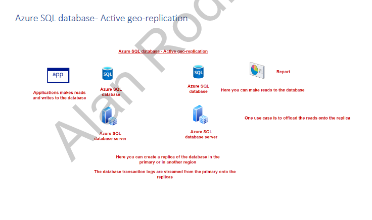
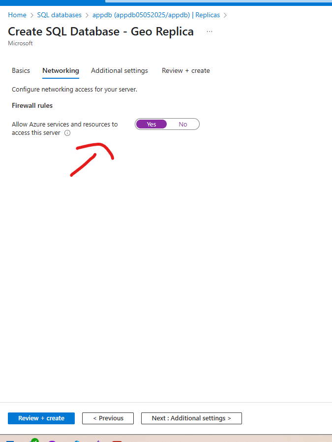
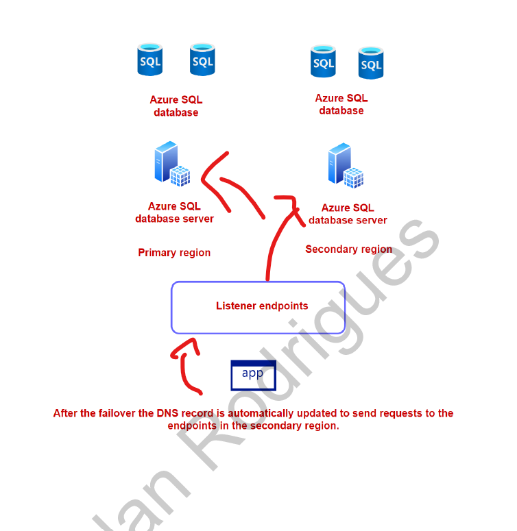
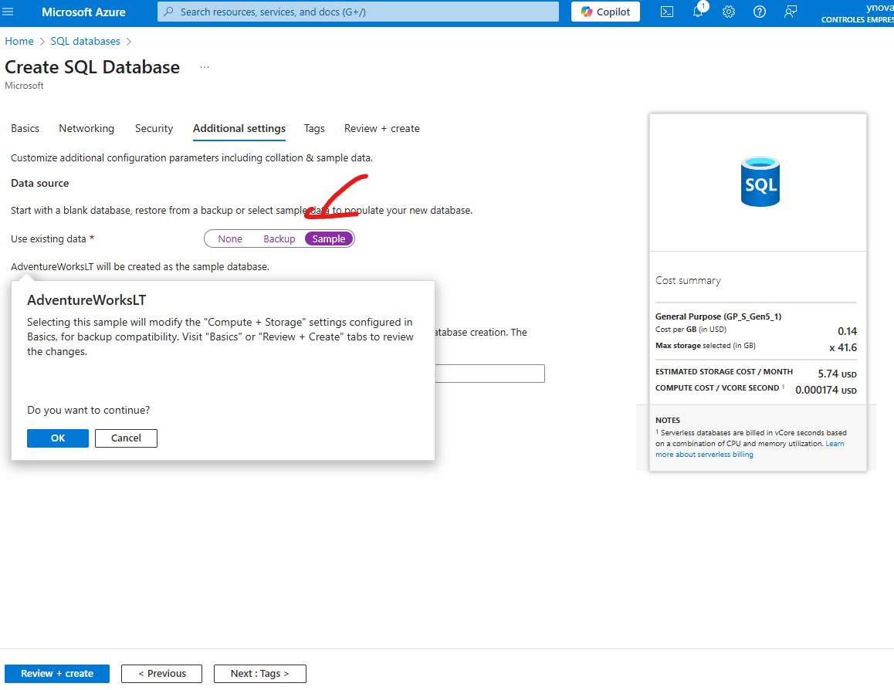
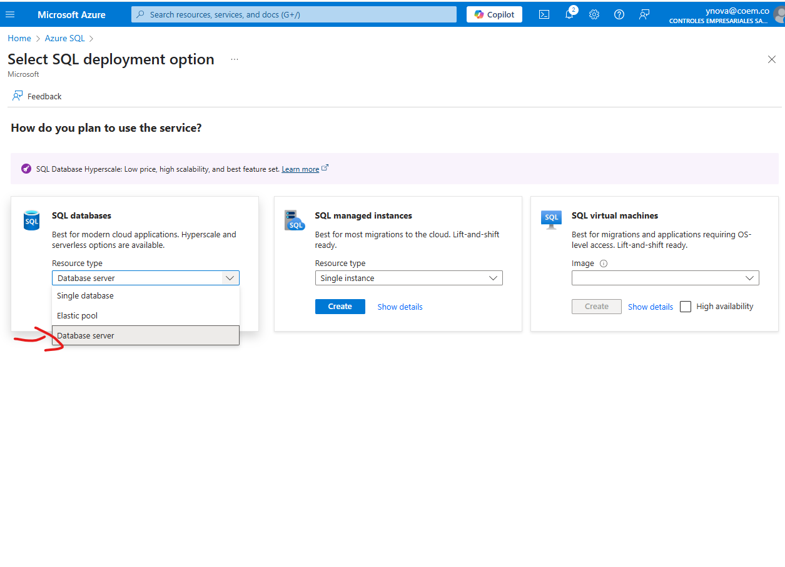
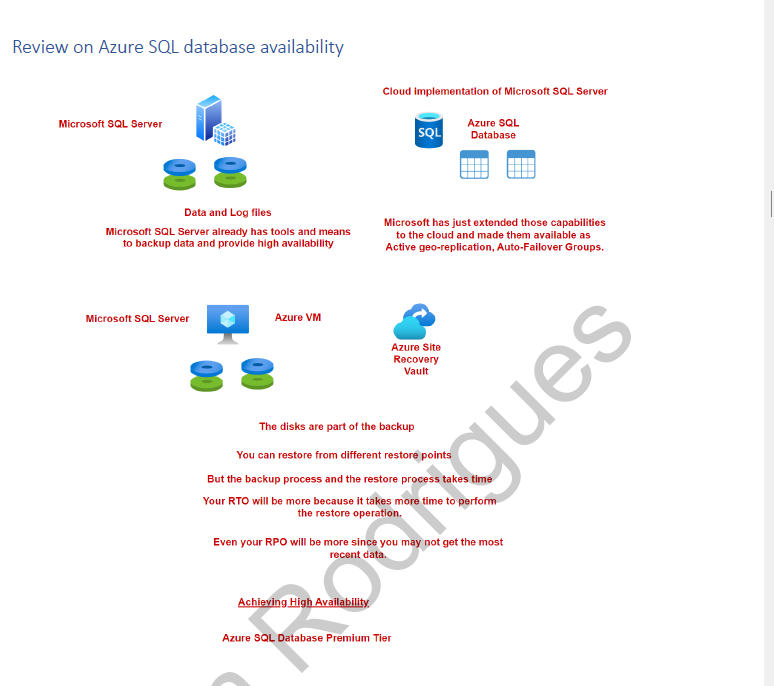
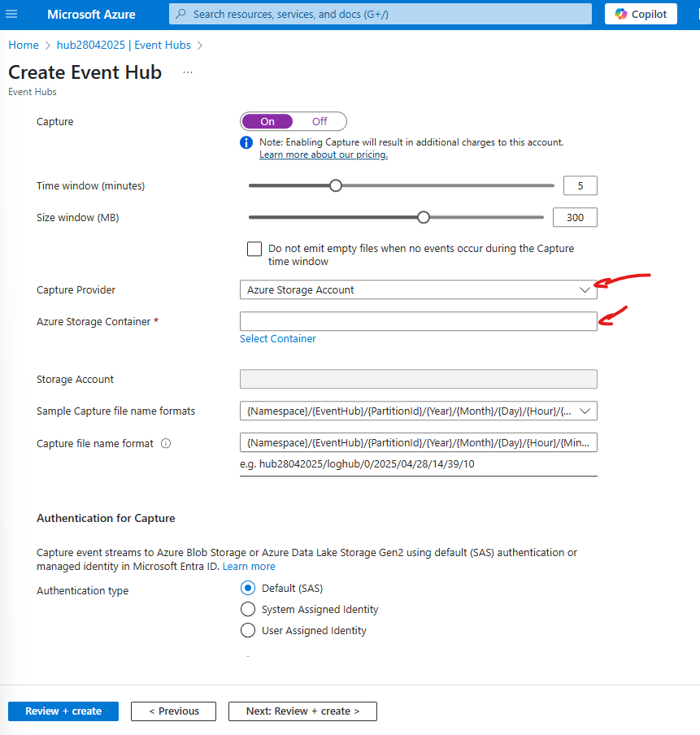
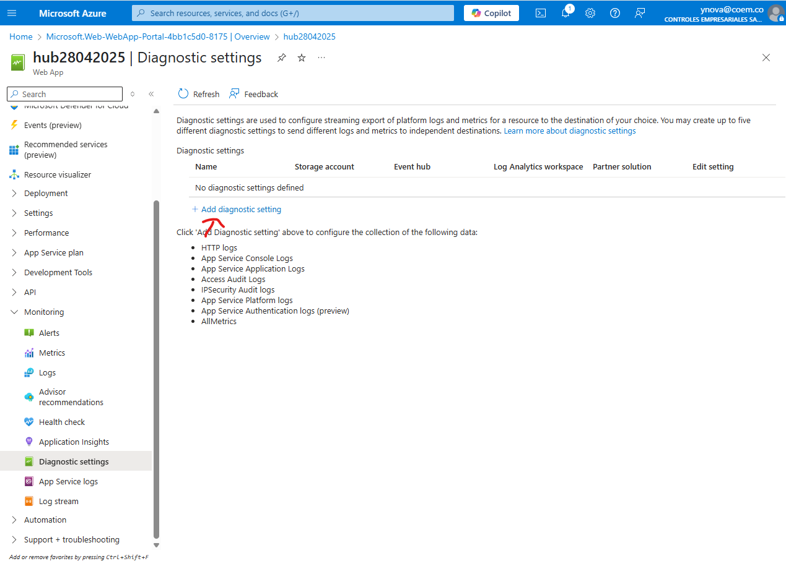
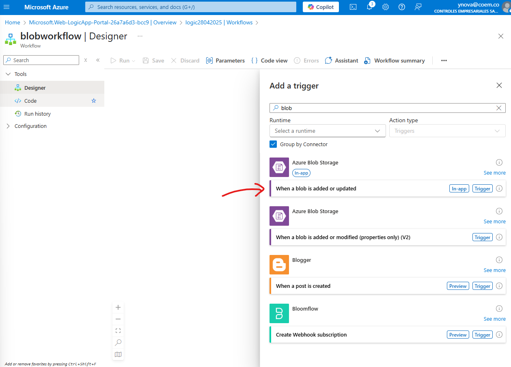

# identity and security


privilege identity management (adicionar los roles pero en modo "elegibility" para que el se los auto asigne en el Privilege identity management)


invitar usuarios externos


# access reviews de permisos en Entra ID


```
https://myapps.microsoft.com/

```


# identity protection


# azure Blueprints


# azure acces control


# manage identities


# azure key vault


# application proxy


# autorization and authentication


# multifactor autentication


validar los metodos de autenticacion de informacion disponibles


# enterprice aplicaiotions para (single sing on)


permisos para poder acceder a la informacion de esta enterprice application,. en este caso la API de graph


# conditional access policies


# Bussines Contrinuity

creacion del server y de la db


utilizar el script sql

```
CREATE TABLE [logdata]
(
        [Id] int,
        [Operationname] [varchar](200) NULL,
	[Status] [varchar](100) NULL,
	[Eventcategory] [varchar](100) NULL,
	[Resourcetype] [varchar](1000) NULL,
        [Resource] [varchar](2000) NULL
)
```

generacion de data

copiar la cadena de conexion y ejecutar el archivo (dejar ejecutar hasta cuantos registros se quiera)


conceptos clave


la base de datos guarda todos los eventos que se han ejecutado en la bd


# azure database backup


maximo 35 dias de retencion de los backups


para el caso de restaurar la base de datos dar click aqui


se abre este menu configurando el punto de restauracion, se puede obtener una base de datos nueva configurada con el RTO (retention Time objetive) maximo de 10 minutos


# sql database redundancy


# link para backups

`https://learn.microsoft.com/en-us/azure/azure-sql/database/troubleshoot-common-connectivity-issues?view=azuresql`


# active geo replication







primero adicionar la ip para que se pueda conectar a la bd


la idea es tener una replica de la base de datos que se actualicé continuamente (en modo readonly)


# failover bd


# auto-failover 

no hay necesidad de cambiar la cadena de conexion entre los failover ya que existe un listener que ayuda con esta gestion internamente.





# auto-failover groups

crear una base de datos nueva en el mismo servidor


adicionar la ip que tenemos actualmente en la session de networking


additional settings

adicionar la opcion de sample



crear la base de datos


crear una base de datos para adicionarla a el failover group





cambiar la localizacion de la creacion de la base de datos secundaria


usar autenticacion de password y usuario


permitir que otros servicios de azure accedan a este recurso


ir a la base de datos y adicionar el nuevo motor creado en una zona diferente


seleccionar las bases de datos


ir a la base de datos secundaria y adicionar la ip que se tiene actualmente para poder conectarse


copiar la direccion del servidor


conectarse con sql management


configuracion del listener del failover group


actualizar la cadena de connexion


validar la cantidad de registos en la bd


crear la tabla primero para poder ejecutar el codigo


escribir algunos registros utilizando la cadena de failover group


forzar el failover


se genera un pequeña interrupcion en el servicio mientras este cambio sucede


review of the sql database




---

## Azure batch


## conectivity onpremise site-to-site, and point-to-site (azure virtual network gateway)


generar point to site configuration


se necesita tener un certificado generado localmente para poder hacer la conexion


generacion del certificado en la maquina point


browse dar nombre y guardar el certificado


abrir con vscode


copiar


pegar y guardar


esperar a que se guarde


descargar el cliente


descomprimir


ya con esta configuracion de VPN ya se puede acceder usando la ip privada de los recursos (no se realizo por problemas de permisos en el equipo)

## virtual wan

solucion para cuando site-to-site se vuelve muy complejo, ya que se tienen muchas subredes, y cada una con un vitual network gateway


se usa un expressroute 


## load balancer


## aplication gateway


## front door como CDN


## front door como balanceador de carga


## redis cache


## event hubs


se crea el namespace pero se necesita crear un event hub


con los codigos de envio y recepcion 


descargar las contraseñas de accesos


crear politica de acceso


sacar connection string


recibir eventos


cleanup policy: no es para guardar data


para hacer persistente los datos y realizar procesamiento de ellos, para guardarlos se usa storage accounts y analizar a posterior




## Azure Functions


## lab scenario


generar el hub, y validar que hub este haciendo backup hacia el storage account.


cambiar la cadena de conexion en la function corriendo local para que escuche los eventos del event hub.


borrar la parte de entitie path


cambiar el nombre del event hub


Crear un app service y en el diagnose settings enviar la informacion al nuevo event hub




guardar y validar


generar trafico en el sitio


colocando la function a correr actualizando la version a la mas reciente se pueden validar los eventos generados 


Crear un cosmosDb (noSql) para enviar los logs del eventhub desde la function


con el uso de data explorer generar un nuevo container a donde mandar los logs del hub


en el segundo proyecto que tiene conexion con cosmos para function actualizar la cadena del hub y el nombre del hub


crear el container en cosmosDB


actualizar la cadena de connecion del codigo


tener en cuenta que cuando se crea pide un nombre de bd, y un nombre de container, por eso el nombre de la bd NO!! es el nombre de la cuenta de cosmos db


codigo funcionando desde local funcion


desplegar la function


## Azure service Bus

storage account al cual se le suben archivos, y se guarda la informacion en un contenedor no procesado y se genera un evento en el service bus, despues con otro codigo se leen los mensajes y se procesa guardando un registro en la bd de cosmosDB


## logic apps




adicionar eror en imgagen es la connection string y el nombre del storage account


adicionar una accion


despues de creada la conexion hacia la cuenta de outlook con las contraseñas pedidas


se pueden adicionar los valores del evento que lo genero


ya llegan las notificaciones de actualizacion 


# Event Grid

crear una function


se puede suscribir a los eventos de un storage account


# Api Management


# migration patterns


# Microsoft Cloud Adoption Framework


# data transfer options to azure 


# azCopy tool


``` azcopy copy "my-local-data" "https://mystorageaccount.blob.core.windows.net/my-container/?<your_sas_token>" --recursive ```


## azure data studio (migracion de dbs, crear configuracion y descargar agente en la VM objetivo)


