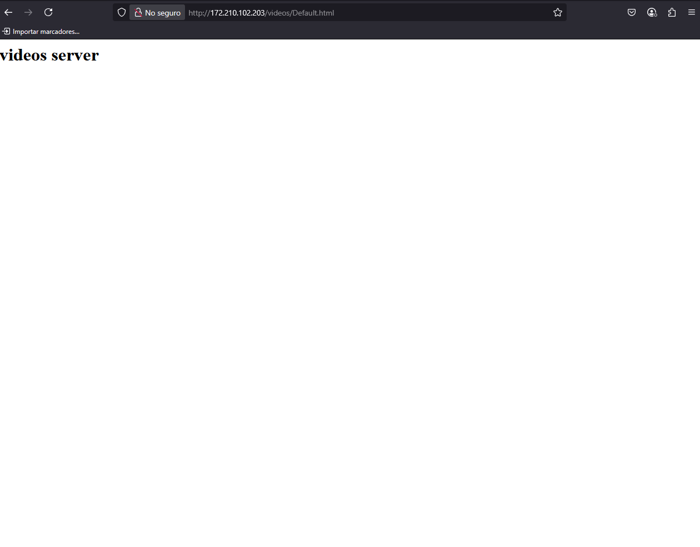

## conectivity onpremise site-to-site, and point-to-site (azure virtual network gateway)

generar point to site configuration

se necesita tener un certificado generado localmente para poder hacer la conexion

generacion del certificado en la maquina point

browse dar nombre y guardar el certificado

abrir con vscode

copiar

pegar y guardar

esperar a que se guarde

descargar el cliente

descomprimir

ya con esta configuracion de VPN ya se puede acceder usando la ip privada de los recursos (no se realizo por problemas de permisos en el equipo)

## virtual wan

solucion para cuando site-to-site se vuelve muy complejo, ya que se tienen muchas subredes, y cada una con un vitual network gateway

se usa un expressroute 

## load balancer

## aplication gateway

## front door como CDN

## front door como balanceador de carga

## redis cache

## event hubs

